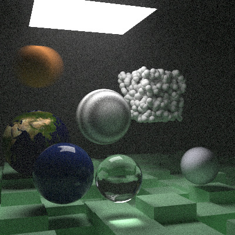

# RayTracer

A C++ ray tracer built by following Peter Shirley's [*Ray Tracing in One Weekend*](https://raytracing.github.io/) series. After digging a little bit more into Ray Tracers I will be building my own one !

## What's implemented so far

- Sphere intersection
- Diffuse (Lambertian), metal, and dielectric (glass) materials
- Antialiasing via multi-sampling
- Configurable camera (field of view, position, depth of field)
- Gamma-corrected color output
- Motion blur, bounding volume hierarchy (BVH)
- Solid, checker, image (stb_image), and Perlin noise textures
- Quads, diffuse lights, and volumes/media (constant density)
- Instance translation and rotation

## Sample renders

After completing the first book: 

After completing the second book, *Ray Tracing: The Next Week*: 

